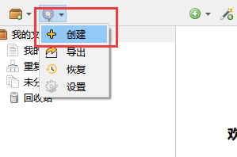
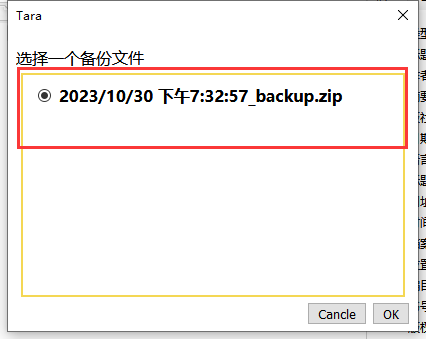
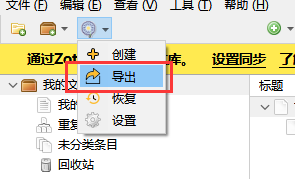

# 备份

我们强烈建议您定期备份 Zotero 数据目录。虽然同步是确保您可以在计算机发生问题时恢复库的好方法，但它并不能完全替代正确的备份：Zotero 服务器仅存储库的最新版本，并且只需要一个（可能是自动）同步以更改服务器副本（尽管可以从 Zotero 的自动备份恢复一些无意的更改）。

在本页中，我们首先介绍 Zotero 运行所需的三类文件，然后介绍若干种备份这些文件的方式。

## 概述

我们将构成 Zotero 正常运行的文件分为三部分：

- Zotero 程序文件 (Program Files)
- Zotero 数据文件 (Zotero Data Folder)
- Zotero 用户配置文件 (Zotero Profile Directory)

### 程序文件

这些文件构成 Zotero 程序的主体，包含了 Zotero 程序的二进制文件（例如 `zotero.exe` 等） 和相关的库文件，不包括您的数据和个性化设置。

这些文件由安装包释放，通常无需额外备份。

### 数据文件

这个目录包含了 Zotero 存储的所有数据，包括您的文献条目信息、笔记、附件、标签、文件夹结构、转换器和引文样式等。这是最重要的部分，因为它包含了您的研究资料。备份数据文件可确保您不会失去已收集的所有信息。

#### 数据文件位置

除非您在 Zotero 首选项的高级窗格中选择了自定义数据目录，否则您的 Zotero 数据将存储在以下与操作系统相关的目录中：

| 系统类型                     | 默认位置                                      |
| ---------------------------- | --------------------------------------------- |
| macOS                        | `/Users/<username>/Zotero`                    |
| Windows 7 and higher Windows | `C:\Users\<User Name>\Zotero`                 |
| Windows XP/2000              | `C:\Documents and Settings\<username>\Zotero` |
| Linux                        | `~/Zotero`                                    |

::: tip

查找 Zotero 数据的最简单、最可靠的方法是单击 `Zotero 首选项` 的 `高级` 选项卡中的 `显示数据目录` 按钮。这将始终显示当前正在使用的数据目录，并且是查找数据目录的推荐方法。

如果您无法访问 Zotero 首选项，搜索文件名`zotero.sqlite`也可以帮助您找到 Zotero 数据目录。

:::

#### 数据文件内容

```bash
northword@Yoga-Northword MINGW64 /d/Northword/Documents/Zotero
$ tree -L 1
.
|-- about config.xul
|-- cache
|-- locate
|-- logs
|-- storage
|-- styles
|-- translators
|-- zotero.sqlite
`-- zotero.sqlite.bak
```

数据目录中最重要的文件是 `zotero.sqlite` 文件，它是包含大部分数据的数据库：项目元数据、注释、标签等。当 Zotero 启动时，它会读取 `zotero.sqlite` 文件。

该目录还包含一个 `storage` 文件夹，其中包含 8 个字符的子文件夹（例如`N7SMB24A`），其中包含所有文件附件，例如 PDF、网页快照、音频文件或您导入的任何其他文件。 （链接的文件不会复制到此子文件夹中。）

您的数据目录可能包含其他几个文件和文件夹。其中可以包括 `zotero.sqlite.bak` （ `zotero.sqlite` 的自动备份，如果现有 `zotero.sqlite.bak` 文件在过去 12 小时内未更新，则定期更新）和 `zotero.sqlite.[number].bak` 文件（在某些 Zotero 更新期间创建的 `zotero.sqlite` 自动备份），以及诸如 `locate` 、 `logs` 等文件夹， `pipes` 、 `styles` 和 `translators` 在 Zotero 启动时自动创建。

::: warning

在复制、删除或移动任何这些文件之前，请确保 Zotero 已关闭。如果在移动这些文件之前不这样做可能会损坏您的数据。

:::

### 用户配置文件

用户配置文件包括您的个性化设置、插件及其配置、数据库位置等。备份用户配置文件可确保您可以轻松地还原您的个性化 Zotero 设置和工作环境。

#### 用户配置文件位置

| 系统类型                     | 默认位置                                                                                      |
| ---------------------------- | --------------------------------------------------------------------------------------------- |
| macOS                        | `/Users/<username>/Library/Application Support/Zotero/Profiles/<randomstring>`                |
| Windows 7 and higher Windows | `C:\Users\<用户名>\AppData\Roaming\Zotero\Zotero\Profiles\<8位随机字符>.default`              |
| Windows XP/2000              | `C:\Documents and Settings\<username>\Application Data\Zotero\Zotero\Profiles\<randomstring>` |
| Linux                        | `~/.zotero/zotero/<randomstring>`                                                             |

::: tip macOS

默认情况下，`/Users/<用户名>/Library` 文件夹是隐藏的。要访问它，请单击桌面，按住 `Option` 键，单击 Finder 的 `转到` 菜单，然后从菜单中选择 `资源库`。

:::

::: tip Windows

默认情况下， `AppData` 是隐藏的，可以在资源管理器搜索栏键入 `%appdata%`，然后按回车，即可进入 `AppData\Roaming` 目录。

:::

#### 用户配置文件内容

这个目录包含 Zotero 的首选项配置，插件信息及其插件配置等。下面列出了部分目录文件：

```bash
northword@Yoga-Northword MINGW64 ~/AppData/Roaming/Zotero/Zotero/Profiles/1y2hj8ud.default
$ tree -L 1
.
|-- bookmarkbackups
|-- browser-extension-data
|-- extensions
|-- extensions.json
|-- prefs.js
|-- times.json
|-- treePrefs.json
|-- webappsstore.sqlite
`-- xulstore.json
```

其中 `prefs.js` 包含 Zotero 的所有首选项，`extensions/` 目录 和 `extensions.json` 包含 Zotero 插件的安装包和安装、启用等信息。

::: warning

如无必要，不要修改这个目录里的任何文件，不当的修改可能导致 Zotero 无法正常启动。

:::

## 手动备份

手动备份可以实现数据的无损备份，包括但不仅限于账户、插件、设置、文献等数据。

首先您需要在新电脑上安装 Zotero，然后将下列表格中旧电脑的数据文件拷贝到新电脑的同一位置。

| 旧电脑                                                                     | 新电脑                                                                 |
| -------------------------------------------------------------------------- | ---------------------------------------------------------------------- |
| `C:\Users<用户名>\AppData\Roaming\Zotero\Zotero\Profiles\*.default` 中文件 | `C:\Users<用户名>\AppData\Roaming\Zotero\Zotero\Profiles\*.default` 中 |
| Zotero-`首选项`-`高级`-`文件和文件夹`-`数据储存位置`中的文件               | 同一路径                                                               |

例如：电脑的用户名为`zotero-chinese`，旧电脑将 Zotero 安装在 `D:\Program Files\Zotero` 目录下，数据储存位置设置为 `C:\Users\zotero-chinese\Zotero`。

在新电脑中，应该要做的是

1. 安装 Zotero，并确保 Zotero 处于关闭状态。

2. 将 **旧电脑** `****.default` 中的文件 拷贝至 **新电脑** `****.default` 中（注意不是复制文件夹本身，而是替换其文件和子文件夹）

3. 将 **旧电脑** `C:\Users\zotero-chinese\Zotero` 拷贝至 **新电脑** `C:\Users\zotero-chinese\Zotero`中

4. 打开 Zotero，即可。

## 使用插件蒲公英 `Tara` 进行数据的备份和恢复

::: tip Tara

[Tara](https://github.com/l0o0/tara/blob/master/README_zh-CN.md) 是一个用于备份和恢复 Zotero 配置的插件，支持备份：

✅备份已安装插件
✅备份 CSL 文件
✅备份转换器 (translators)
✅备份 Locate 文件夹
✅备份 Zotero 配置及插件配置

下载地址：[GitHub](https://github.com/l0o0/tara) 或 [中文社区插件合集页](https://plugins.zotero-chinese.com)

:::

### 创建备份

下载安装 Tara 插件后，通过点击 `Tara` 图标来创建一个备份



创建成功后，会在Zotero中生成一个 `Tara_backup` 的条目并自动生成一个 ZIP 格式的附件，这个就是备份文件。

如果你再点一次创建，会再生成个附件，你可以选择不同时间段的备份文件进行恢复。


### 恢复备份

点击`恢复`


可以根据时间来选择要恢复的备份



等待备份恢复完成，再重启 Zotero


### 导出备份文件

点击`导出`



等待完成后，去备份目录查看文件是否生成


导出时，会将当成的配置信息和插件导出到一个单独 ZIP 文件中，导出的备份会默认储存在 `数据储存文件夹\backup` 下。


### 在新电脑上进行数据恢复

在新电脑上安装了 Zotero，此时 Zotero 上没有任何插件，配置都是默认的。这时，你可以把第三步导出的2个文件复制到新电脑上。

在新电脑 Zotero 上，先安装 `Tara.xpi` 插件。

插件安装成功，点击恢复，会出现一个文件选择的窗中，选择第三部中所生成的备份文件，之后Zotero会恢复对应的插件及相关配置。

### 在不同电脑上同步备份

当你在多个电脑上同时使用 Zotero 时，可以通过 Zotero 的 `同步功能` 来实现数据的快速备份和恢复。

首先在不同电脑上分别配置同步，然后可以在 A 电脑上创建一个备份，备份文件是随条目一起同步的。那 B 电脑 Zotero 应该会自动同步了创建的备份条目 `Tara_backup` 及对应的附件。

当你在 B 电脑的 Zotero 上点击恢复，选择 A 电脑上刚创建的备份。这样两台电脑上的 Zotero 配置和插件信息就一起同步了。

::: tip 注意修改 Tara 的 “备份 Locate” 设置

由于不同系统平台或主机上的文件路径可能不一致，tara 在备份时默认过滤掉了 `locate` 文件夹，可以通过点击 `Tara 图标-设置` 进行修改。

:::
