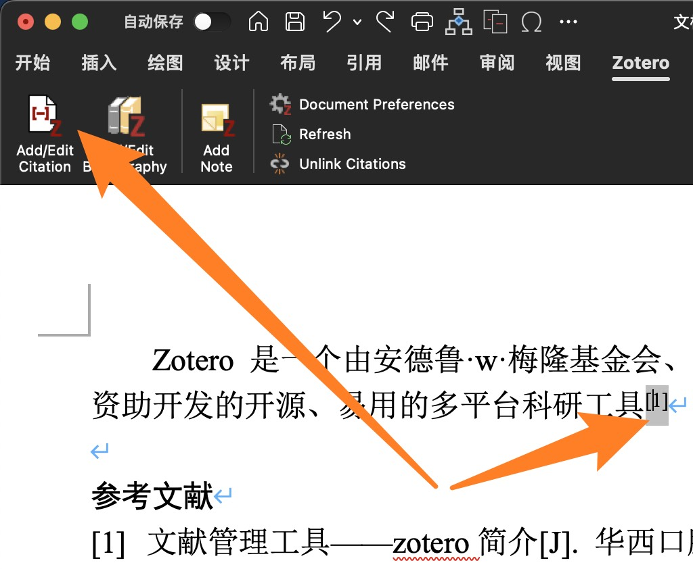
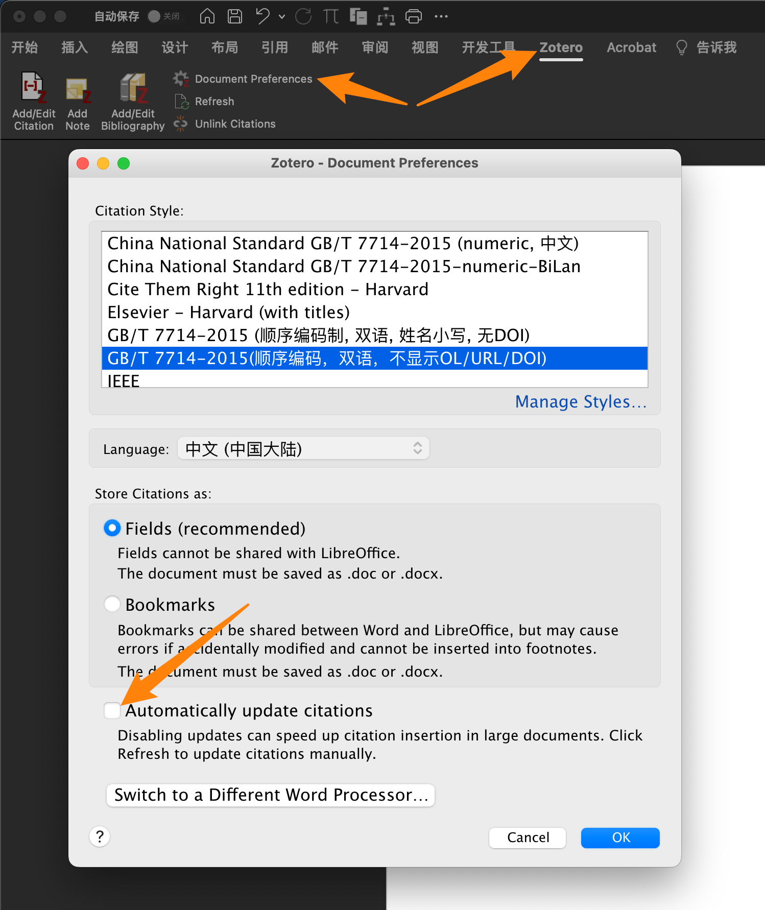
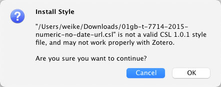
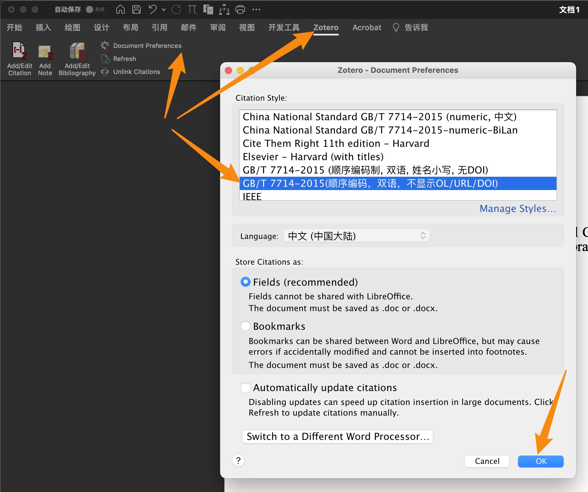
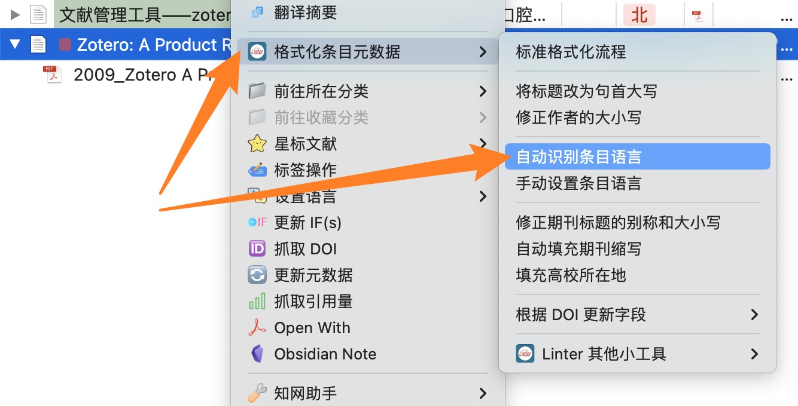

## 插入参考文献的基础教程

在开始排查问题之前，请务必先了解 Zotero 的 Word 加载项中各个按钮的功能和用法。在 Word 中插入参考文献的基本操作请阅读：

[在 Word 中插入参考文献的基础教程](../ms-word-plugin.md)

此外，关于 Zotero 参考文献插入及排版的基本教程您还可以观看这个视频：

[Zotero 文献在 Word 中的引用](https://www.bilibili.com/video/BV1ma4y1f7yg/)

其中包括以下问题的解答：
1. 如何安装/重新安装 Word 中的 Zotero 工具条（Word 加载项）。
2. 如何从 Zotero 官方下载参考文献格式。
3. 如何在 Word 中插入参考文献。
4. 如何在 Word 中设置引用样式。

::::: tip 提醒

请注意， **Zotero 在更新至6.0.23或更高版本后，Word 选项卡里的按钮顺序有调整。** 新版本交换了第二个和第三个按钮的位置， **在阅读教程的时候请注意点击的按钮具体是哪一个，不要只去数是第几个按钮。** 

:::: details 按钮功能说明

**目前新版本里横向布置三个大按钮分别是：** 

1.  **插入/编辑引注**  `Add/Edit Citation`

在当前光标位置插入或编辑引注。

::: tip

此按钮只是插入引注，不会在文末自动生成参考文献表。要插入参考文献表，请点击 `插入/编辑参考文献表` 按钮。

:::

2.  **插入/编辑参考文献表**  `Add/Edit Bibliography`

在光标当前位置插入或编辑已存在的参考文献表。

::: note

一般情况下，在文末写一个 `参考文献` 标题，然后按回车另起一行，再点击这个按钮插入参考文献表。

:::

3.  **插入笔记**  `Add Note`

在光标当前位置插入笔记。

::: tip

此功能不常用，点击后会出现黄色插入框。如果不小心点开了，可以用键盘上的 `Esc` 键关闭黄色插入框。

:::

**三个纵向布置的小按钮分别是：** 

1.  **文档首选项**  `Document Preferences`

更改参考文献样式或语言，开启/关闭自动更新引注功能。

2.  **刷新**  `Refresh`

更新引注引注编号及文末参考文献表内容，关闭自动更新引注功能后需手动点击此按钮更新引注。

3.  **取消链接引注**  `Unlink Citations`

删除所有 Zotero 域代码且断开与 Zotero 文库链接。点击后所有的引注和文末的参考文献表都会变成纯文本。

::: warning

该操作不可逆，一旦断开连接，所有的引注信息都会变成纯文本，无法再自动更新编号和参考文献表，也无法恢复到以前带有链接的状态。因此强烈建议在断开连接之前将文档另存一份备用，仅将用于提交/共享的副本断开连接。

:::

::::

:::::

::: warning

在插入文献之前， **请务必先将 Zotero 里英文论文详细信息中的 `语言/Language` 字段改为** `en` 或 `en-US` 等与文献语言一致的信息，否则在中英文混排时可能会遇到错误。具体方法见后文里 **中英文混排** 部分的内容。

:::

## 插入引用常见的操作问题

在实际使用中，有一些操作上的小技巧，在这里略作整理：

1.  **Zotero 有两种插入文献的方式，一种是搜索对话框，另一种是经典视图的选择窗：** 

如果你在使用新式搜索框，推荐采用`年份 作者姓名`进行检索（两个关键词中间敲一个空格）。

这两种界面可以在插入的时候临时切换，也可以在 Zotero首选项 里修改默认使用经典选择窗。操作步骤请参见[在 Word 中插入参考文献的基础教程](../ms-word-plugin.md)

2. 如果你使用搜索框， **输入中文关键词后没有候选项目** ，请 **按一下键盘的空格键** ，然后就有候选项了。

3. 如果你 **在一处位置想同时引用多个文献** ，请在插入引用时 **一次性插入每一个文献** ，不要分成两次分开插。

:::: tip

**在使用搜索窗时** ，先加入第一个文献，然后不要急着按回车确认插入，而是改为 **按一下空格然后继续搜下一个文献** 。直到所有文献都完成插入之后再按回车确认本次插入。

**在使用经典选择窗时** ，点击左下角的 `多重来源/Multiple Sources` 来实现同时插入多个文献。具体操作请参见[在 Word 中插入参考文献的基础教程](../ms-word-plugin.md)

::: note

注：这个窗口内可以多选，可以在左边窗口一次性选择多个条目，然后统一点向右的箭头加到右边。待全部文献添加完成后，再点击确认完成插入。

:::

::::

4. 如果你 **在插入完成后想重新修改引用信息** ，请先在 Word 中插好的编号角标中间点一下，使输入光标在角标内（此时角标会变为灰色），然后点 `插入/编辑引注` 按钮即可编辑/增删此处引用的文献。

{width=60%}

5. 在 `插入/编辑引注` 过程中，请务必在选择文献过程中 **不要转到其他窗口去翻看查阅** 。如果边翻看边插入，很有可能导致插入失败并报错。如果插入过程中希望查阅信息，你可以先按回车键确认本次插入，待查阅完成后再用第 4 点提醒中的方法编辑/补充引用。

6. Zotero 在插入文献时更新角标的速度非常缓慢， **建议关闭自动更新引用** 。这一设置在 Word 中的 Zotero 选项卡内：

{width=60%}

在关闭之后，你 **需要在增删引用项目后手动点 `刷新` 按钮更新引用信息及编号** 。在 Zotero 6.0 新版本下，这个更新可能非常缓慢，你需要多一点耐心。

## 中英文混排以及其他特殊要求样式的问题

Zotero 官方样式对于中英文混排支持得十分差劲，尤其是在 `等` 和 `et al.` 的处理上。幸运地是，有很多热心的大佬在这方面进行了许多探索。

csl 格式的样式文件的下载和安装方法可以查看这一教程：

[利用合适的CSL，结合设置条目语言解决et al和等混排问题](https://gitee.com/zotero-chinese/zotero-chinese/issues/I4YKIN)

:::: tip

对于一般的需求，可以在这个项目中寻找最适合你的样式，然后直接拿来用：

[GB/T 7714相关的csl以及Zotero使用技巧及教程](https://github.com/redleafnew/Chinese-std-GB-T-7714-related-csl)

[GB/T 7714相关的csl以及Zotero使用技巧及教程](https://gitee.com/redleafnew00/Chinese-STD-GB-T-7714-related-csl)

这里有非常多的常见样式，足以满足几乎所有人的需求。上面的页面里也都附上了相应的使用效果方便挑选。

::::

安装 csl 样式文件中，会有两个弹窗。第一个弹窗请点击 `安装/Install`，第二个弹窗请点击 `确认/OK`：

{width=60%}

（上图是第二个弹窗，这个报错不用担心，直接点 `OK` 即可）

安装完 csl 样式文件后，你还 **需要在 Word 中指定当前文档使用的样式** ：

{width=60%}

::: warning

请务必注意， **样式的选择是在 Word 里进行的** ，不是在 Zotero 设置里！Zotero 设置里的列表仅用来安装新样式，不能用作选择默认样式！

:::

### 如果上面现成的样式不能满足你的需求……

你也可以根据你自己的需要修改属于自己的样式文件，可以看一下这个视频教程自行定制样式：

[style csl文件简单编辑](https://zhuanlan.zhihu.com/p/336009544)

## 注意事项及与样式相关的常见问题

1. 中英文混排的各个样式文件通常是依靠 Zotero 文献条目信息中的 `语言/Language`，你需要在插入参考文献之前 **预先将英文和中文文献的语言设定为相应要求的内容** 。一般来说，常见的中英混排 csl 样式文件通常要求将英文文献 `Info` 中 `语言/language` 字段修改为`en`，而中文文献设置成`zh`、`zh_CN`或其他内容基本都可以。

::: warning

请务必注意，英文文献的语言需要设置为 `en` ，而不是其他任何内容！（即便设置成 english 也不行！）

如果你的文献语言设定不规范，可以通过标题或作者字段对所有文献进行排序，然后分别选中英文文献，将其 [语言] 字段的信息统一为 `en`；取消选中后再选中中文文献，将其 `语言` 字段的信息统一为`zh`或者样式文件要求的样子。

插件 [Linter for Zotero](https://github.com/northword/zotero-format-metadata) 提供了自动识别条目语言并设定语言字段的功能，可前往 [插件商店](https://plugins.zotero-chinese.com)下载安装。

{width=60%}

:::

2. 请 **在添加文献前修改语言** ，否则可能会导致 Word 中插入的引用和 Zotero 中的数据断开联系，无法更新到你设置的新语言，也不再会随你更改的其他信息变化。（这个问题是网友反馈的，我没有验证是否确实会这样，也没找到解决方案。如果你有更优雅的办法，欢迎在下面评论）

3. 如果你设置了新样式后，样式仍未变更，你可以在 **Word 上 `Zotero` 插件选项卡中的 `Document Preferences` 里** 随意切换到任何一个其他样式，确定。等待更新完成后，重新进设置里改回你想用的设置，文档会再次刷新，然后就好了。

4. Word 中参考文献的显示内容是 csl 文件决定的。如果你觉得 **参考文献里显示的内容** 不符合你的要求，你需要按照前面的教程修改 csl 文件。

5. 如果你设置的样式全都正确，却发现有的正文角标里的内容多了点东西（页码），可以编辑一下这一处引用，把不必要的信息删掉：

## 参考文献书目列表的排版

**Word 中参考文献书目列表的排版问题是 Word 段落样式控制的。** 其中包括：是否首行缩进，是否悬挂缩进，编号和后续文字之间的制表位空白大小，字体及文字大小，是否全部加粗，行间距大小……

这部分样式你需要 **在 Word 中修改参考文献对应的样式** （[书目] 的样式）。具体方法详见这一教程：

[如何设置Zotero生成的参考文献格式，刷新后不变？](https://zhuanlan.zhihu.com/p/58969571)

## 更多教程……

关于 Zotero 以及参考文献等问题还有很多很多教程，你可以关注 [青柠学术] 微信公众号，查看历史推文中的更多教程：

[Zotero 文献生态](https://mp.weixin.qq.com/mp/appmsgalbum?__biz=MzAxNzgyMDg0MQ==&action=getalbum&album_id=1319074508795641857&scene=173)

Johnmy 老师也制作了非常多的关于 Zotero 的教程，如果有疑问也请务必在这里多找找多看看：

[GB/T 7714相关的csl以及Zotero使用技巧及教程](https://gitee.com/redleafnew00/Chinese-STD-GB-T-7714-related-csl)

[一些软件使用过程中的技巧，如Endnote, Zotero，R等](https://zhuanlan.zhihu.com/c_1071081428967743488)
