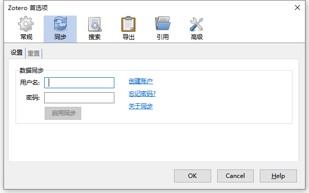
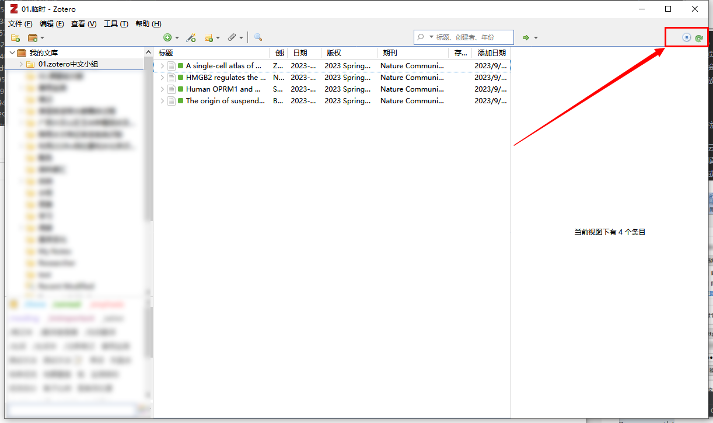
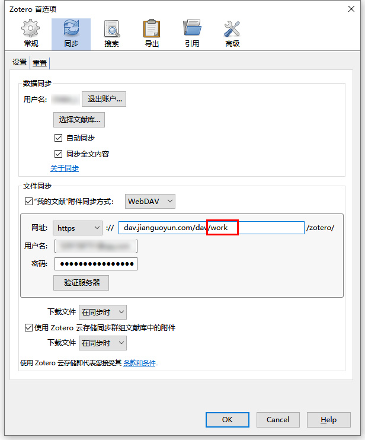

# 数据与文件的同步

---

title: 数据与文件的同步
icon: async
date: 2023-09-23 20:52:08
updated: 2023-09-23 20:52:08

---

无论您使用何种方式进行同步，您都需要注册一个Zotero的官方账户，用于同步pdf注释以及笔记。如果您没有注册，可点击[这里](https://www.zotero.org/user/register)进行快速注册。

之后您可以在 zotero-编辑-首选项-同步-设置中 输入您的帐号密码，进行登陆。

   

每个Zotero用户都可以获得300 MB的免费Zotero存储空间，用于存储附加文件，并可[购买更大的存储空间](https://www.zotero.org/settings/storage?ref=sib)。如果您拥有钞能力，这是最简单的备份方法，在登陆您的zotero账户并完成购买后无需其他任何设置。

| Storage Limit  |             Cost (USD)              |
| :------------: | :---------------------------------: |
|     300 MB     |                Free                 |
|      2 GB      | $20/year (equal to $1.67 per month) |
|      6 GB      |  $60/year (equal to $5 per month)   |
| Unlimited 无限 | $120/year (equal to $10 per month)  |

如果您想免费进行进行文件的同步，那么您具有两种网盘同步方式：**支持Webdav的网盘（推荐）**和**第三方同步盘**。对于新手，建议从Webdav网盘同步入手，在熟悉各种问题的解决方法和同步原理后，可尝试第三方网盘的同步方式。

::: tip

💡 Tips

对于新手，建议从Webdav网盘同步入手，在熟悉各种问题的解决方法和同步原理后，再尝试第三方网盘的同步方式。

:::

## Webdav同步（推荐）

::: tip

💡 什么是Webdav

Webdav是一组基于超文本传输协议的技术集合，有利于用户间协同编辑和管理存储在万维网服务器文档。
通俗一点儿来说，WebDAV 就是一种互联网方法，应用此方法可以在服务器上划出一块存储空间，可以使用用户名和密码来控制访问，让用户可以直接存储、下载、编辑文件。

:::

目前国内支持Webdav同步的只有坚果云网盘，常见的如百度网盘、阿里云盘、Onedrive等均不支持Webdav同步。后续教程将以坚果云网盘为例。

如果您没有坚果云网盘的账户，请点击[这里](https://www.jianguoyun.com/d/signup)快速注册。

坚果云免费用户具有以下限制：

* 流量与空间限制：每月上传流量1G/月、下载流量3G/月、空间受限于上传流量，

* 文件上传大小限制：当前 WebDAV 客户端和网页端上传大小的限制是一致的，默认为 500M（私有云可以通过相关设置调整）。

* 访问频率限制：由于WebDAV协议比较占用系统资源，免费版用户限制访问频率为每30分钟不超过600次请求。付费用户限制访问频率为每30分钟不超过1500次请求。

当然对于大部分用户免费账户是完全够用的（虽然每个月只有1g上传流量，但是好处是每个月都可以有1g，一年最多可以拥有12g）。对于小部分用户，可通过付费[购买专业版](https://www.jianguoyun.com/s/pricing)或者使用其他支持Webdav同步的网盘。

### 电脑

1. [登陆](https://www.jianguoyun.com/d/login)您的坚果云账户。

2. 登录后点击 右侧用户名=>账户信息  
   

3. 选择安全选项，下滑到底，点击添加应用。
   

4. 完成后，记录下生成的密码。

   
   

5. 打开zotero,编辑——首选项——同步——文件同步，使用zotero改成WebDAV，并填写你的坚果云的服务器地址：https://dav.jianguoyun.com/dav。
用户名是坚果云账号，密码是上一步中的应用密码（非坚果云账号登录密码），设置好后点击Verify Server即可。
   

6. 到此处，电脑上关于坚果云的同步设置就完成了。

7. 回到首页，点击右边的绿色的圈就可以同步更新，如果是第一次设置，会提示在坚果云里自动创建一个名叫：zotero的文件夹，用于存放同步更新的文件。
   

::: tip

💡 自定义存放路径

如果在坚果云里新建了一个文件夹，想将文件放在那个文件夹里的话，那么在填写服务器地址时，需要添加对应的文件夹名字（建议文件夹用英文或数字命名），例如work，那么服务器地址填写如下:
  
此时，你的zotero的同步文件将会放在 **根目录/work/zotero** 中

:::

### Ios（待施工）

### Android（待施工）

## 第三方网盘（待施工）