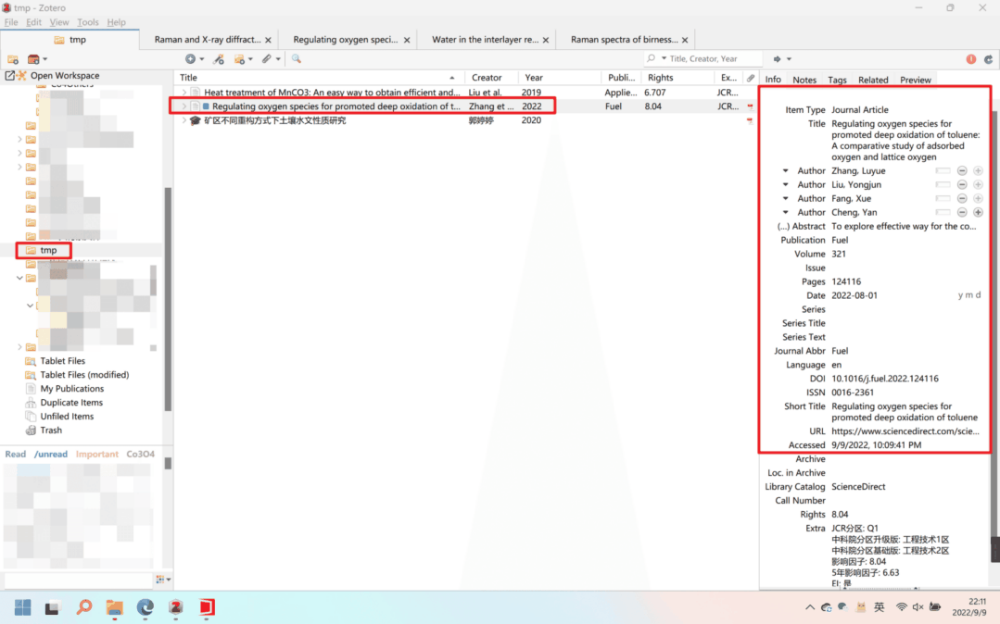

# 编辑条目

<Badge text="中级" />

::: tip 始终及时校准条目

使用 Zotero（或任何其他参考文献管理器）进行引用时，在将项目保存到库中后，应始终检查项目的准确性。

Zotero 并不能保证自动抓取的数据 100% 正确，有时 Zotero 收到的元数据是不完整或不正确的。

我们应始终意识到这个问题，养成导入后随手校正的习惯。

:::

## 重复条目 <Badge text="中级" />

::: info Todo：待完善

参考：<https://www.zotero.org/support/duplicate_detection>

:::

由于各种原因，您可能会导入一些重复的项目。例如，您可能从同一网页保存同一项目多次，或者以前看的文献没印象了又新导入了一次。当你写论文插入参考文献时，重复条目会严重影响正确性，例如，你可能在不同地方引入同一文献的不同副本，而 Zotero 会认为它们是两个不同的文献。幸运的是，Zotero 可以帮助您识别可能的重复项并允许您合并它们。

::: tip 插件推荐

插件 [Linter for Zotero](./plugins/linter.md) 和 [Zopliacte](https://github.com/ChenglongMa/zoplicate) 提供了对新增条目提醒重复的功能。

:::

## 条目字段

从以上方法导入的数据并不一定是完全正确的，最好养成导入条目后随手校正的习惯。

如下图所示，在中心窗格中选择一个条目后，右侧（标准视图）或下侧（堆栈视图）会显示该条目的书目信息。多数条目都可以直接单击进行编辑，更改自动保存。



以下是一些比较特殊的字段，拿出来单独介绍：

### 条目类型

请尤其注意这一个选项，这直接决定在引用时，该条目以什么方式出现。且该项在通过浏览器导入时非常容易出错。

最典型的错误就是将「期刊文章/学位论文」等识别为「网页」。这会导致部分引文格式后出现 `[EB/OL]` 等文献标识符。

这时我们应该重新导入或手动更正。

### 期刊缩写

部分期刊要求使用「期刊标题的缩写」进行引用，Zotero 将「期刊名全称」和「期刊名缩写」分别保存在「期刊」和「期刊缩写」两个字段中。

抓取时不一定能准确获得期刊缩写，写论文引用前最好校正一下。

通常期刊缩写的差别多数在于加不加 `.`，例如「Applied Surface Science」可以缩写为「Appl Surf Sci」或「Appl. Surf. Sci.」。我们建议总是存储为加 `.` 的格式。因为去掉 `.` 总是比加上 `.` 更方便，在引用时，对于需要不加 `.` 的期刊就可以通过 CSL 直接去掉 `.`。

::: tip 插件推荐

插件 [Linter for Zotero](./plugins/linter.md) 提供了自动获取期刊的 ISO 4 缩写的功能，可前往 [插件商店](https://zotero-chinese.com/plugins)下载安装。

:::

### 标题

#### 标题中的上下标

```html
<sub>下标内容</sub>
<sup>上标内容</sup>
<i>斜体</i>
<b>粗体</b>
```

详细请参阅：[在 Word 参考文献表中实现斜体及上下标效果](./faqs/word-addon.md#设置斜体及上下标等)。

::: tip 插件推荐

插件 [Linter for Zotero](./plugins/linter.md) 提供了辅助输入这些富文本标签的功能，可前往 [插件商店](https://zotero-chinese.com/plugins)下载安装。

:::

#### 标题的大小写

我们建议您始终将标题以「句子大小写」的形式存储在 Zotero 库中，这有利于 CSL 进行格式转换。

什么是「句子大小写」？

```plain
- 标题大小写：Mechanism of Ce-Modified Birnessite-MnO<sub>2</sub> in Promoting SO<sub>2</sub> Poisoning Resistance for Low-Temperature NH<sub>3</sub>-SCR
- 句子大小写：Mechanism of Ce-Modified Birnessite-MnO<sub>2</sub> in promoting SO<sub>2</sub> poisoning resistance for low-temperature NH<sub>3</sub>-SCR
```

### 其他 extra

所有其他自定义字段均应保存在「其他（extra）」字段，保存在该字段的数据应为若干个键值对，每行一个。CSL 引用时可以通过键来调用值。
